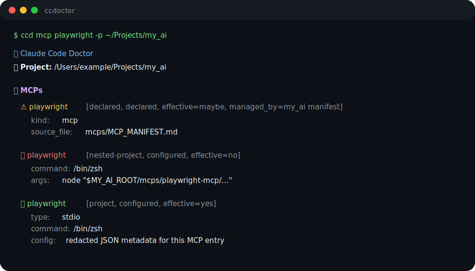

<div align="center">
  <a href="https://github.com/Cookie-HOO/ccdoctor">
    <picture>
      <source media="(prefers-color-scheme: dark)" srcset="docs/assets/logo-dark.svg">
      <source media="(prefers-color-scheme: light)" srcset="docs/assets/logo-light.svg">
      
    </picture>
  </a>
  <h1 style="font-size: 28px; margin: 10px 0;">ccdoctor</h1>
  <p>从终端、脚本和 Agent 检查 Claude Code 的可见配置。</p>
</div>

<p align="center">
  <a href="https://github.com/Cookie-HOO/ccdoctor" target="_blank">
    
  </a>
  <a href="https://docs.astral.sh/uv/guides/tools/" target="_blank">
    
  </a>
  
  
  
</p>

<p align="center">
  <a href="README.md">English</a>
  ·
  <a href="#all-demos">查看演示</a>
  ·
  <a href="https://github.com/Cookie-HOO/ccdoctor/issues/new?labels=bug">报告 Bug</a>
  ·
  <a href="https://github.com/Cookie-HOO/ccdoctor/issues/new?labels=enhancement">请求功能</a>
  ·
  <a href="#agent-和-llm-用法">Agent 用法</a>
  ·
  <a href="#命令参考">命令参考</a>
</p>

<br>

`ccdoctor` 是一个面向 Claude Code 项目的本地诊断 CLI。它会从指定项目根目录出发，报告 Claude Code 能看到的 MCP、Skill、Hook、Plugin、Provider/Model 设置、Agent、权限、statusline 配置、诊断信息以及治理 manifest 声明。

它刻意做成 shell CLI，而不是全局 MCP。这样你可以在终端、CI、脚本或 Agent 中随时运行它，而不需要给 Claude Code 再增加一个始终可见的 MCP server。

> [!TIP]
> Agent 和 LLM 流水线建议优先使用窄范围 JSON 查询：`NO_COLOR=1 ccd --json <category> [name] -p <project>`。

<details>
<summary>目录（点击展开）</summary>

- [为什么用 ccdoctor？](#为什么用-ccdoctor)
- [Quickstart](#quickstart)
- [All Demos](#all-demos)
  - [项目总览](#项目总览)
  - [分类视图](#分类视图)
  - [单项详情视图](#单项详情视图)
  - [JSON 自动化](#json-自动化)
  - [Markdown 输出](#markdown-输出)
  - [Doctor 模式](#doctor-模式)
- [命令参考](#命令参考)
  - [选项](#选项)
  - [分类](#分类)
- [输出字段参考](#输出字段参考)
  - [`scope` 取值](#scope-取值)
  - [`provider` 取值](#provider-取值)
  - [`effective` 取值](#effective-取值)
  - [诊断严重级别](#诊断严重级别)
- [Agent 和 LLM 用法](#agent-和-llm-用法)
- [安全性](#安全性)
- [资源](#资源)

</details>

# 为什么用 ccdoctor？

Claude Code 的配置可能同时来自很多地方：项目文件、用户设置、插件、软链接、manifest、嵌套项目根目录以及运行时默认能力。`ccdoctor` 会给你一份只读报告，区分哪些是已经配置的、哪些只是声明的、哪些预计真正生效。

- **可见性排查** — 查看 Claude Code 对某个项目能发现哪些 MCP、Skill、Hook、Plugin、Agent、Provider 设置和权限。
- **适合 Agent 使用** — 通过过滤后的 JSON 输出，让 Agent 不用读取无关文件也能理解配置状态。
- **治理检查** — 对比项目/运行时状态和 manifest 声明，发现过期、重复或嵌套配置。
- **安全诊断** — 默认只读，并对 key 名看起来像 token、key、secret、cookie、password、auth 的值做脱敏。
- **多种输出模式** — 面向人的终端输出、面向自动化的 JSON、面向 issue/PR 的 Markdown，以及脚本可用的 `--doctor` 退出码。

# Quickstart

不安装，直接运行一次：

```bash
uvx ccdoctor
uvx --from ccdoctor ccd mcp
```

安装一次，之后在任意目录运行 `ccd`：

```bash
uv tool install ccdoctor
ccd
ccd mcp
```

从 GitHub 安装，而不是从 PyPI 安装：

```bash
uv tool install git+https://github.com/Cookie-HOO/ccdoctor
ccd
```

检查另一个项目：

```bash
ccd -p ~/Projects/my_ai
```

只看某个分类或某个具体条目：

```bash
ccd mcp
ccd mcp playwright
ccd hook PreToolUse
ccd skill profile-project-bootstrap
```

获取机器可读输出：

```bash
NO_COLOR=1 ccd --json mcp playwright -p ~/Projects/my_ai
```

# All Demos

<p align="center">
  
</p>

## 项目总览

```bash
ccd -p ~/Projects/my_ai
```

```text
✨ Claude Code Doctor
📁 Project: /Users/example/Projects/my_ai

🧠 Provider / Model
  • 🧠 model: claude-opus-4-8

🔌 Plugins
  ✅ claude-mem@thedotmack [user, installed-plugin, effective=yes]

🧰 MCPs
  ✅ playwright [project, configured, effective=yes] type=stdio command=/bin/zsh
  ⚠️ fetch [declared, declared, effective=maybe, managed_by=my_ai manifest]
```

## 分类视图

```bash
ccd mcp -p ~/Projects/my_ai
```

```text
✨ Claude Code Doctor
📁 Project: /Users/example/Projects/my_ai

🧰 MCPs
  ✅ playwright [project, configured, effective=yes] type=stdio command=/bin/zsh source=/Users/example/Projects/my_ai/.mcp.json
  ✅ mcp-search [user, plugin-provided, effective=yes, managed_by=claude-mem@thedotmack] type=stdio command=node
  ⚠️ fetch [declared, declared, effective=maybe, managed_by=my_ai manifest]
```

## 单项详情视图

```bash
ccd mcp playwright -p ~/Projects/my_ai
```

```text
🧰 MCPs
  ✅ playwright [project, configured, effective=yes] type=stdio command=/bin/zsh source=/Users/example/Projects/my_ai/.mcp.json
    kind: mcp
    name: playwright
    scope: project
    provider: configured
    effective: yes
    source_file: /Users/example/Projects/my_ai/.mcp.json
    metadata:
      type: stdio
      command: /bin/zsh
      args:
        [
          "-lc",
          "node \"$MY_AI_ROOT/mcps/playwright-mcp/node_modules/@playwright/mcp/cli.js\""
        ]
```

Hook 详情同理：

```bash
ccd hook PreToolUse -p ~/Projects/my_ai
```

```text
🪝 Hooks
  ✅ PreToolUse [user, configured, effective=yes] summary=[{"hooks": [{"command": "...", "type": "command"}], "matcher": "*"}]
    kind: hook
    name: PreToolUse
    scope: user
    provider: configured
    effective: yes
    source_file: /Users/example/.claude/settings.json
    metadata:
      config:
        [
          {
            "hooks": [{"command": "...", "type": "command"}],
            "matcher": "*"
          }
        ]
```

## JSON 自动化

```bash
ccd --json mcp playwright -p ~/Projects/my_ai
```

```json
{
  "mcps": [
    {
      "effective": "yes",
      "kind": "mcp",
      "metadata": {
        "args": ["-lc", "node \"$MY_AI_ROOT/mcps/playwright-mcp/node_modules/@playwright/mcp/cli.js\""],
        "command": "/bin/zsh",
        "type": "stdio"
      },
      "name": "playwright",
      "provider": "configured",
      "scope": "project",
      "source_file": "/Users/example/Projects/my_ai/.mcp.json"
    }
  ],
  "project_root": "/Users/example/Projects/my_ai"
}
```

## Markdown 输出

```bash
ccd --markdown hook PreToolUse -p ~/Projects/my_ai
```

它会生成 Markdown 标题和 JSON metadata 代码块，适合粘贴到 GitHub issue 或 PR 评论中。

## Doctor 模式

```bash
ccd --doctor -p ~/Projects/my_ai
```

| Code | 含义 |
|---:|---|
| `0` | 没有 warning 或 error。 |
| `1` | 发现 warning 诊断。 |
| `2` | 发现 error 诊断。 |

# 命令参考

```text
ccd [options] [category] [name]
ccdoctor [options] [category] [name]
```

## 选项

| 选项 | 含义 |
|---|---|
| `-p, --project PATH` | 检查另一个项目目录。默认是当前目录。 |
| `--json` | 输出稳定、已脱敏的 JSON，适合自动化。 |
| `--markdown` | 输出 Markdown 表格/详情，适合 issue 和 PR。 |
| `--doctor` | 如果发现 warning/error，返回非零退出码。 |
| `--verbose, -v` | 包含 source path、allowlist 和诊断 hint 等更多信息。 |
| `--include-runtime` | 运行可选的只读运行时探测，目前是 localhost proxy `/health`。 |

## 分类

| 分类 | 别名 | 显示内容 |
|---|---|---|
| Provider/model | `provider`, `model` | 模型、statusline、Claude/Anthropic 环境设置、可选 runtime probe。 |
| Plugins | `plugin`, `plugins` | 已安装/启用的 Claude Code plugin 和 plugin metadata。 |
| MCPs | `mcp`, `mcps` | 项目、嵌套项目、plugin-provided、manifest-declared MCP servers。 |
| Skills | `skill`, `skills` | 项目 skills、plugin-provided skills、runtime/manifest-declared skills。 |
| Agents | `agent`, `agents` | 项目 agents、profile-provided agents、plugin-provided agents。 |
| Hooks | `hook`, `hooks` | 用户/项目 hooks 和 plugin-provided hook events。 |
| Permissions | `permission`, `permissions` | Claude Code allow/deny 权限设置。 |
| Diagnostics | `diagnostic`, `diagnostics`, `diag` | 收集状态时发现的 warnings/errors。 |

在分类后传入 `name` 可以缩小到匹配条目，并输出详情 metadata：

```bash
ccd mcp playwright
ccd hook PreToolUse
ccd skill profile-project-bootstrap
ccd plugin claude-mem
```

# 输出字段参考

每条记录都是一个 `StatusItem`，常见字段如下：

| 字段 | 含义 |
|---|---|
| `kind` | 记录类型，例如 `mcp`、`skill`、`hook`、`plugin`、`agent`、`permission`。 |
| `name` | 记录名称。 |
| `scope` | 记录来自哪里。 |
| `provider` | 记录由什么机制提供或管理。 |
| `effective` | Claude Code 是否预计能看到或使用该记录。 |
| `managed_by` | 可选的管理方，例如 plugin 名称或 `my_ai manifest`。 |
| `source_file` | 发现该记录的文件或目录。 |
| `metadata` | 类型相关详情；key 名看起来像密钥的值会脱敏。 |
| `diagnostics` | 条目级诊断信息。 |

## `scope` 取值

| 值 | 含义 |
|---|---|
| `project` | 直接配置在被检查项目中。通常在 Claude 从该目录启动时生效。 |
| `user` | 来自当前用户的 Claude Code 配置或 plugin 安装。 |
| `nested-project` | 位于项目树下，但不是当前被检查的根目录。通常对当前根目录不生效。 |
| `runtime` | 来自 Claude Code runtime 或生成的 runtime manifest。 |
| `declared` | 出现在治理 manifest 中，但不一定已经运行时配置。 |
| `custom` | 自定义本地来源，目前用于部分 agent/profile 记录。 |

## `provider` 取值

| 值 | 含义 |
|---|---|
| `configured` | 来自具体 Claude Code 配置文件，例如 `.mcp.json` 或 `.claude/settings.json`。 |
| `custom` | 来自本仓库的自定义 skill/tool/profile 区域。 |
| `installed` | 来自本仓库管理的 installed assets。 |
| `installed-plugin` | 来自 Claude Code 的 installed plugin registry。 |
| `plugin-provided` | 由 Claude Code plugin 提供。 |
| `runtime-built-in` | 由 Claude Code runtime 或 runtime skill list 声明。 |
| `profile-provided` | 来自项目 profile 定义。 |
| `declared` | manifest 中列出的治理/声明状态。 |

## `effective` 取值

| 值 | 含义 |
|---|---|
| `yes` | 预计对被检查项目可见/生效。 |
| `no` | 被发现，但预计不会对被检查项目生效。 |
| `maybe` | 已声明或可推断，但仅靠静态文件无法证明运行时生效。 |
| `ok` | runtime probe 成功。 |
| `failed` | runtime probe 失败。 |

## 诊断严重级别

| 严重级别 | 含义 |
|---|---|
| `info` | 信息提示。 |
| `warning` | 可能过期、不生效、缺失或异常。`--doctor` 返回 `1`。 |
| `error` | 配置损坏或格式错误，需要处理。`--doctor` 返回 `2`。 |

# Agent 和 LLM 用法

Agent 和 LLM 流水线建议优先使用窄范围 JSON 查询。相比终端输出，JSON 更小、更稳定，也更容易解析。

```bash
NO_COLOR=1 ccd --json <category> [name] -p <project>
```

示例：

```bash
NO_COLOR=1 ccd --json mcp playwright -p /repo
NO_COLOR=1 ccd --json hook PreToolUse -p /repo
NO_COLOR=1 ccd --json skill profile-project-bootstrap -p /repo
NO_COLOR=1 ccd --json diagnostics -p /repo
```

推荐 Agent 流程：

1. 先运行 `ccd --json diagnostics -p <project>`。
2. 如果诊断提到 MCP，运行 `ccd --json mcp -p <project>`。
3. 在建议修改配置前，用 `ccd --json mcp <name> -p <project>` 查询具体条目。
4. 回复中引用 `source_file`、`scope`、`provider`、`effective`，方便用户核对。

可直接放进 Agent prompt 的片段：

```text
Run `NO_COLOR=1 ccd --json diagnostics -p <project>`. If warnings or errors exist, inspect the relevant category with `ccd --json <category> [name] -p <project>`. Do not modify files. Summarize findings with source_file, scope, provider, effective, and a recommended next action.
```

为什么 Agent 应该用 JSON，而不是文本输出？

- `--json` 不包含 ANSI 颜色码。
- 包含已脱敏 metadata，便于推理。
- 可以按 category 和 name 过滤，减少 token 使用。
- 避免读取无关项目配置。

# 安全性

`ccdoctor` 默认只读。它不会修改 Claude Code settings、plugin config、MCP config 或项目文件。它不会读取 `.env` 文件。key 名看起来像 token、key、secret、cookie、password 或 auth 的值会在输出前脱敏。

可选 runtime probing 只有在传入 `--include-runtime` 时才运行。运行时探测限制为 `127.0.0.1` 或 `localhost` 这类本地 endpoint。

Manifest-only 条目表示治理声明状态，不代表运行时一定可见。

---

# 资源

- [uv tools guide](https://docs.astral.sh/uv/guides/tools/) — 使用 `uvx` 运行 Python 命令行工具。
- [Claude Code documentation](https://docs.anthropic.com/en/docs/claude-code) — Claude Code 概念和配置文档。
- [GitHub repository](https://github.com/Cookie-HOO/ccdoctor) — 源码、issues 和 releases。
